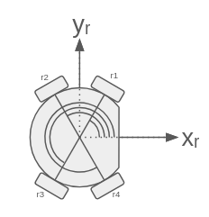

# Repo for the Neon_SSL_firmware

## Motors orientation

| Motor id | Blue Pill | Angle  | Board id |
|----------|-----------|--------|----------|
| 1        | U1        | 60     | U3       |
| 2        | U1        | 120    | U4       |
| 3        | U2        | 240    | U5       |
| 4        | U2        | 300    | U6       |
